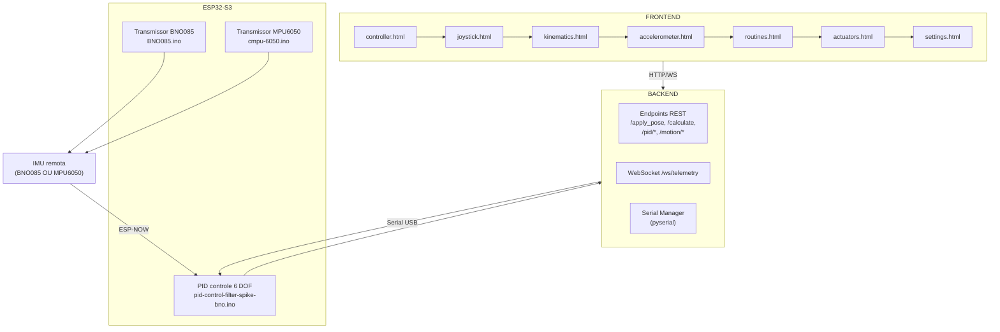

[JAVASCRIPT__BADGE]: https://img.shields.io/badge/JavaScript-000?style=for-the-badge&logo=javascript
[CSS3__BADGE]: https://img.shields.io/badge/CSS3-%231572B6.svg?style=for-the-badge&logo=css3&logoColor=white
[FastAPI__BADGE]: https://img.shields.io/badge/FastAPI-005571?style=for-the-badge&logo=fastapi
[TailwindCSS__BADGE]: https://img.shields.io/badge/tailwindcss-%2338B2AC.svg?style=for-the-badge&logo=tailwind-css&logoColor=white
[HTML5__BADGE]: https://img.shields.io/badge/html5-%23E34F26.svg?style=for-the-badge&logo=html5&logoColor=white

<div align="center">


<hr/>

<h1 align="center" style="font-weight: bold;">PLATAFORMA DE STEWART</h1>

![HTML5][HTML5__BADGE]
![CSS3][CSS3__BADGE]
![TAILWIND][TailwindCSS__BADGE]
![JAVASCRIPT][JAVASCRIPT__BADGE]
![FASTAPI][FastAPI__BADGE]

</div>

## Visão Geral

Esta documentação consolida o ecossistema do projeto da Plataforma de Stewart (IFSP – TCC 2025), abrangendo o **frontend** (interfaces web em Three.js/Vanilla), o **backend** (FastAPI + Serial) e os **firmwares** do ESP32-S3. Abaixo você encontrará uma visão macro dos módulos, instruções de instalação/execução e um guia de versionamento, além de links para documentação detalhada de cada funcionalidade.

## Arquitetura Macro



# Iniciando

## Instalação

### Pré-requisitos

#### Versão do Python

- Python **3.12.17**

#### Dependências Python

As bibliotecas do backend estão em `interface/backend/requirements.txt`. Instale-as com:

```bash
pip install -r requirements.txt
```

Conteúdo atual:

```
# ==== API e servidor Web  ====
fastapi==0.104.1
starlette==0.27.0
uvicorn[standard]==0.24.0.post1
pydantic==2.5.3
python-multipart==0.0.9

# ==== Científico ====
numpy==1.26.4
scipy==1.13.1

# ==== Serial ====
pyserial==3.5

# ==== Utilitários ====
python-dotenv==1.0.1
typing-extensions>=4.8,<5
```

#### Ambiente ESP32-S3/ESP32

- **Arduino IDE 2.x**
- **Core ESP32**: _esp32 by Espressif Systems_ v2.0.15
- **Bibliotecas adicionais**:
  - SparkFun BNO08x Cortex Based IMU – v1.0.6
- **Driver USB–Serial**: CP210x USB to UART Bridge  
  Download e instruções: [Robocore – Instalando driver do NodeMCU](https://www.robocore.net/tutoriais/instalando-driver-do-nodemcu)

#### Outros

- **Node.js** LTS (para rodar servers estáticos, bundlers opcionais etc.).
- **Ferramentas de linha de comando**: `git`, `make` (opcional), `python -m http.server` ou similar para servir o frontend.

### Backend (FastAPI)

1. Entre em `interface/backend`.
2. Crie (opcional) um ambiente virtual e instale dependências:
   ```bash
   python -m venv .venv
   source .venv/bin/activate  # Linux/macOS
   .\.venv\Scripts\activate   # Windows PowerShell
   pip install -r requirements.txt
   ```
3. Execute o servidor:
   ```bash
   uvicorn app:app --reload --host 0.0.0.0 --port 8001
   ```
4. Confirme que a API responde em `http://localhost:8001/docs`.

### Frontend

O frontend é estático. Basta abrir os arquivos `.html` diretamente no navegador ou servir via um servidor local (ex.: `live-server`, `python -m http.server`, etc.). Para páginas que dependem de módulos ES6, verifique se o navegador carrega via `file://` sem bloquear. Recomenda-se rodar um server simples:

```bash
cd interface/frontend
python -m http.server 8080
# Abrir http://localhost:8080/controller.html
```

> Existe também um script pronto (`start.bat`) na raiz do repositório. Ele abre duas janelas de terminal: uma com o backend FastAPI (`uvicorn`) e outra com `python -m http.server 8080` para o frontend. Basta executar `start.bat` para subir ambos.

### Firmware ESP32-S3

1. Abra `esp32s3_codes/pid-control-filter-spike-bno/pid-control-filter-spike-bno.ino` (ou variantes) no Arduino IDE (ESP32 S3 board selecionada) ou PlatformIO.
2. Ajuste as constantes de pinagem/ganhos conforme necessário.
3. Compile e faça upload via USB.

> Consulte [PID-CONTROL-FILTER-SPIKE-BNO.md](PID-CONTROL-FILTER-SPIKE-BNO.md) para detalhes completos do firmware.

## Execução e Fluxo

1. **Ligar o ESP32-S3** com o firmware PID. Ele aguardará setpoints pela serial e telemetria pelo sensor.
2. **Iniciar o backend** (`uvicorn app:app --reload --port 8001`).
3. **Abrir uma página do frontend**:
   - `joystick.html` para controle via joystick.
   - `kinematics.html` para cálculos de cinemática.
   - `accelerometer.html` para controle por IMU.
   - `routines.html` para rotinas de movimentoBN e gráficos.
   - `actuators.html` para controle PID e telemetria.
   - `settings.html` para ajustes rápidos de ganhos/offsets.
4. Conectar-se à porta serial na UI e ativar as funcionalidades desejadas.

## Documentação por Módulo

- **Controle por Joystick (controller/joystick)**  
  [JOYSTICK-CONTROL-README.md](JOYSTICK-CONTROL-README.md) – explica endpoints (`/joystick/pose`), mapeamentos dos eixos, telemetria, segurança e UI.
- **Cinemática (kinematics.html + kinematics.js)**  
  [KINEMATICS-README.md](KINEMATICS-README.md) – descreve o preview 3D, inputs e integração com `/calculate` e `/apply_pose`.
- **Controle por Acelerômetro**  
  [ACCELEROMETER-README.md](ACCELEROMETER-README.md) – modo roll/pitch/yaw via IMU (MPU/BNO), WebSocket de telemetria, recalibração e comandos `/mpu/control`.
- **Rotinas de Movimento**  
  [ROUTINES-README.md](ROUTINES-README.md) – presets, Chart.js, IndexedDB para gravação, endpoints `/motion/*`.
- **Painel de Atuadores / PID**  
  [ACTUATORS-README.md](ACTUATORS-README.md) – telemetria, setpoints, comandos manuais, export CSV, integração com `/pid/*`.
- **Painel de Configurações**  
  [SETTINGS-README.md](SETTINGS-README.md) - explica como ler/aplicar `kp/ki/kd`, deadband, PWM mínimo via `/pid/gains` e `/pid/settings`.
- **Integração FlightGear**  
  [FLIGHTGEAR-README.md](FLIGHTGEAR-README.md) - ponte Telnet->FastAPI que lê roll/pitch do simulador, valida com `/calculate`, publica pré-visualização e envia poses seguras via `/apply_pose`.
- **Firmware ESP32-S3**
  - [PID-CONTROL-FILTER-SPIKE-BNO.md](PID-CONTROL-FILTER-SPIKE-BNO.md) – loop PID principal no ESP32-S3.
  - [BNO085-README.md](BNO085-README.md) – transmissor ESP-NOW baseado no sensor SparkFun BNO08x (Euler + quaternions).
  - [MPU6050-README.md](MPU6050-README.md) – transmissor ESP-NOW com MPU-6050 (roll/pitch/yaw simples).

## Código do ESP32-S3

O código principal está em `esp32s3_codes/pid-control-filter-spike-bno/`. Ele implementa:

- **ESP-NOW** para receber dados do sensor de orientação (MPU6050 ou BNO085) e gravar MAC para comandos de retorno.
- **Controle PID** com feedforward e anti-windup.
- **Parser serial** para receber setpoints e ajustes vindos do backend (comandos `spmm6x`, `kpmm`, `u0a`, `offset`, etc.).
- **Telemetria** no formato CSV, compatível com gráficos no frontend (`actuators.html`).

> Transmissores auxiliares:
>
> - [BNO085-README.md](BNO085-README.md) - leitura do SparkFun BNO08x (Euler + quaternions) e envio por ESP-NOW.
> - [MPU6050-README.md](MPU6050-README.md) - versão simplificada usando MPU6050_light.

### Principais integrações com o backend

- `apply_setpoint_all` e `apply_setpoint_individual` são acionados via `/apply_pose` (controller/joystick).
- `set_pid_gains`, `set_pid_offset`, `set_pid_feedforward` são usados pelas páginas `settings` e `actuators`.
- Comandos manuais (`man=adv`, `man=ret`, `man=free`) são expostos no painel de atuadores para testes de bancada.

## Versionamento

O repositório utiliza Git (branch padrão `docs/atualiza-documentacao`). Recomenda-se o seguinte fluxo:

1. **Commits frequentes** por feature:
   - `feature/frontend-joystick-z-trigger`
   - `feature/backend-motion-endpoints`
   - `docs/add-accelerometer-readme`
2. **Pull Requests** para revisão (incluir referência a issues do Trello/Jira).
3. **Tags** para releases estáveis:
   - `v1.0.0` – primeiro release funcional (controle manual + PID).
   - `v1.1.0` – inclui modos de rotinas, telemetria e joystick Z-trigger.
4. **Changelogs** no README ou em `CHANGELOG.md`.

### Autor

**Guilherme Miyata** - Instituto Federal de São Paulo (IFSP)  
Trabalho de Conclusão de Curso - 2025

---

<a href='https://github.com/g-Miyata'>Github</a><br>
<a href='www.linkedin.com/in/g-miyata'>Linkedin</a><br>
<a href='https://www.g-miyata.com'>Portfólio</a>

**Última atualização:** Novembro 2025
