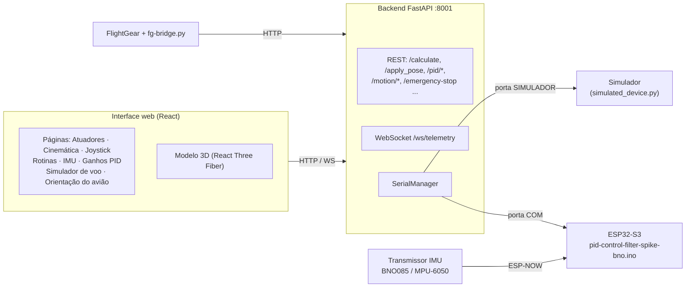

[REACT__BADGE]: https://img.shields.io/badge/react-%2320232a.svg?style=for-the-badge&logo=react&logoColor=%2361DAFB
[TS__BADGE]: https://img.shields.io/badge/typescript-%23007ACC.svg?style=for-the-badge&logo=typescript&logoColor=white
[THREE__BADGE]: https://img.shields.io/badge/three.js-000000?style=for-the-badge&logo=threedotjs&logoColor=white
[FastAPI__BADGE]: https://img.shields.io/badge/FastAPI-005571?style=for-the-badge&logo=fastapi
[TailwindCSS__BADGE]: https://img.shields.io/badge/tailwindcss-%2338B2AC.svg?style=for-the-badge&logo=tailwind-css&logoColor=white

<div align="center">


<hr/>

<h1 align="center" style="font-weight: bold;">PLATAFORMA DE STEWART</h1>

![REACT][REACT__BADGE]
![TYPESCRIPT][TS__BADGE]
![THREE.JS][THREE__BADGE]
![TAILWIND][TailwindCSS__BADGE]
![FASTAPI][FastAPI__BADGE]

</div>

## Visão Geral

Este repositório reúne o projeto da Plataforma de Stewart do IFSP (TCC 2025):

- **interface web** em React + Three.js (`interface/web`), com modelo 3D da bancada, tema claro/escuro e acessibilidade;
- **backend** FastAPI (`interface/backend`), que calcula a cinemática e conversa com o ESP32 pela serial;
- **firmwares** do ESP32-S3 (`esp32s3_codes`).

O backend também tem um **dispositivo virtual (simulador)**: dá para usar toda a interface e validar movimentos sem hardware.

## Arquitetura


```mermaid
flowchart LR
    subgraph Web ["Interface web (React)"]
        P["Páginas: Atuadores · Cinemática · Joystick<br>Rotinas · IMU · Ganhos PID<br>Simulador de voo · Orientação do avião"]
        V["Modelo 3D (React Three Fiber)"]
    end

    subgraph Backend ["Backend FastAPI :8001"]
        R["REST: /calculate, /apply_pose, /pid/*,<br>/motion/*, /emergency-stop ..."]
        W["WebSocket /ws/telemetry"]
        S["SerialManager"]
    end

    SIM["Simulador<br>(simulated_device.py)"]
    FW["ESP32-S3<br>pid-control-filter-spike-bno.ino"]
    IMU["Transmissor IMU<br>BNO085 / MPU-6050"]
    FG["FlightGear + fg-bridge.py"]

    Web -->|HTTP / WS| Backend
    S -->|porta COM| FW
    S -->|porta SIMULADOR| SIM
    IMU -->|ESP-NOW| FW
    FG -->|HTTP| Backend
```

## Executando

### Pré-requisitos

- **Python 3.12** oficial para Windows ([python.org](https://www.python.org/downloads/windows/)). A 3.12.10 é a última 3.12 com instalador para Windows. Na instalação, marque _Add python.exe to PATH_.
  - Cuidado com Pythons embutidos em outros programas (por exemplo o do Inkscape), que criam o ambiente virtual num formato incompatível. O `start.bat` detecta e recusa esses casos.
- **Node.js não é necessário** para usar a bancada: o build da interface (`interface/web/dist`) vem pronto no repositório. Só é preciso Node 24 para desenvolver o frontend.

### Iniciar

Na raiz do projeto:

```bat
start.bat
```

O script:

1. procura o Python 3.12 (primeiro `py -3.12`, depois `python`);
2. cria o ambiente virtual em `interface/backend/.venv` e instala as dependências;
3. sobe o FastAPI em `http://localhost:8001`;
4. abre a interface em **http://localhost:8001/**.

| Endereço                      | Conteúdo                                               |
| ----------------------------- | ------------------------------------------------------ |
| http://localhost:8001/        | Interface nova (React)                                 |
| http://localhost:8001/antigo/ | Interface antiga (HTML/JS), mantida durante a migração |
| http://localhost:8001/docs    | Documentação interativa da API                         |

> Se aparecer "O ambiente virtual existente é inválido", apague a pasta `interface/backend/.venv` e rode o `start.bat` de novo.

### Pelo celular (rede local)

No PC, abra a tela **Celular** (menu ou botão no cabeçalho) e clique em **Ligar o modo rede**: o backend passa a atender também em **HTTPS 8443** na rede, sem reiniciar, e a tela mostra o QR code, o endereço (`https://<IP-do-PC>:8443/celular`) e o **PIN**. Para já abrir ligado:

```bat
start.bat rede
```

- Com `start.bat rede`, o backend escuta na rede em **HTTP 8001** e **HTTPS 8443**, no mesmo processo (`interface/backend/serve.py`). O HTTPS usa um certificado autoassinado gerado na primeira vez em `interface/backend/certs/`, e é ele que libera o giroscópio do celular (os navegadores só dão o sensor em HTTPS).
- No celular, aceite uma vez o aviso de certificado e digite o PIN. **Um celular por vez:** com um já conectado, o PC mostra qual é (aparelho, IP, há quanto tempo) e o botão para desconectá-lo; um segundo celular vê o aviso e só entra depois. No celular, **Desconectar** (no topo) libera a vez. O PC também mostra quem abriu a página e está esperando o PIN, e pode gerar outro PIN.
- Sem o PIN, o celular só acompanha. O botão **PARAR** funciona sempre, em qualquer aparelho. O próprio PC nunca pede PIN. Um IP que erra o PIN 5 vezes fica bloqueado por um minuto.
- A tela `/celular` tem **giroscópio** (incline o celular e o tampo acompanha, com zerar, sensibilidade e iniciar/parar), **joystick na tela** (dois sticks, Z e yaw) e **Bancada 3D por toque** (P1–P6 ou tampo, − / + que repetem ao segurar, desfazer e ao vivo). O controle para sozinho se a tela apagar, se o sensor parar ou numa parada de emergência.
- **Firewall:** na primeira vez, o Windows pergunta se libera o Python; permita em **redes privadas**. Para liberar à mão, num prompt de administrador:
  `netsh advfirewall firewall add rule name="Plataforma de Stewart" dir=in action=allow protocol=TCP localport=8001,8443 profile=private`

## Modo simulação (sem hardware)

No topo da interface, escolha **Simulador** e clique em **Conectar**. O selo muda para **SIMULAÇÃO** (azul). Nada físico se move, e todas as páginas funcionam.

- O backend passa a usar `interface/backend/simulated_device.py` no lugar da porta serial. Ele aceita os mesmos comandos do firmware (`spmm6x=`, `sel=`, `kpmm=`, `A`/`R`/`OK`...), roda o mesmo PID e responde com a mesma telemetria CSV.
- A dinâmica de cada atuador (velocidade máxima e zona morta) foi ajustada aos ensaios de degrau reais (`MATLAB/workspace1-6.mat`) por `interface/backend/tools/fit_sim_params.py`, com fit de ~90%. Os parâmetros ficam em `interface/backend/sim_params.json`.
- No modelo 3D, a plataforma sólida é a medida (telemetria) e o **fantasma verde** é a pose comandada. A diferença entre as duas mostra o atraso real dos atuadores.
- A página **Rotinas** estima a velocidade de pico que cada movimento exige e avisa quando ela passa do que os atuadores sustentam (~12 mm/s).
- Nas páginas Joystick e IMU há controles virtuais (sliders) para quando não há gamepad ou sensor.
- A **Bancada 3D** (`/bancada-3d`) traz o modelo mais detalhado, com tela cheia. Clique num pistão e arraste a seta para mudar só o comprimento dele: os outros cinco ficam fixos e o tampo se acomoda pela cinemática direta. Clique no ponto verde do tampo para mover a plataforma inteira em Z, roll, pitch ou yaw. Tudo também funciona pelo teclado.

Para usar o hardware, selecione a porta COM do ESP32-S3 e confirme. O selo fica vermelho, **HARDWARE REAL**.

### Criar, ensinar e analisar

Além das páginas de controle, o menu tem:

| Página | O que faz |
| --- | --- |
| **Gravar e reproduzir** (`/gravar`) | Grava o que é comandado em qualquer página (indicador ● REC no topo), vira poses-chave numa linha do tempo com interpolação suave, prévia no modelo e reprodução na plataforma (`POST /motion/trajectory`, 60 Hz). Confere curso e velocidade antes de mover. |
| **Programação em blocos** (`/blocos`) | Blocos no estilo Scratch (Blockly): mover para, mover eixo, esperar, repetir, rotinas prontas. O programa vira uma trajetória, com a lista de passos em texto. |
| **Apresentação** (`/apresentacao`) | Tela para feiras e exposições, em página inteira (tema escuro ou claro, pelo botão no canto). Mostra um show automático de 6 cenas (título, 6 graus de liberdade, pistões ao vivo, simulador de voo, cinemática) e quem toca na tela ou mexe no gamepad assume o controle, voltando ao show após 30 s. A bancada física só se move pelo **painel do operador** (tecla **O** ou segurar o logo): quiosque com amplitude e velocidade limitadas, controle do público na bancada (até 5°) e tempo de sessão. No painel também dá para trocar o show pelo **Simulador de voo**: um voo gravado do ERJ145 toca em laço pelo motion cueing (washout), com instrumentos na tela, a imagem do FlightGear no canto quando ele está aberto e, se o operador ligar, a bancada engatada no cueing. `?cena=voo` abre direto numa cena e `?modo=voo` no simulador de voo. |
| **Aula de cinemática** (`/aula`) | Curso em dois módulos, na notação do TCC (aᵢ, bᵢ, p, R, Lᵢ = ‖p + R·bᵢ − aᵢ‖). **Conhecendo a Plataforma**: peças, história, 6 GDL, atuadores e juntas, referenciais {B} e {P}. **Cinemática**: seriais × paralelos com um braço UR5e (cadeia DH e as até 8 soluções da inversa) e um braço 2R, pose e matrizes com números ao vivo, inversa passo a passo e direta com experimento, esferas de restrição e as iterações do solver. Tem perguntas rápidas e o progresso fica salvo. |
| **Jogo da bolinha** (`/jogo`) | Incline o tampo e leve a bolinha ao alvo, em 5 fases. Pode espelhar na plataforma (até 5°, devagar). |
| **Espaço de trabalho** (`/espaco-de-trabalho`) | Volume que o centro do tampo alcança com os limites reais, corte colorido pelo limite que está mais perto (curso, cardã da base, cardã do tampo ou folga entre pernas), inclinação máxima por direção e alcance de cada eixo com e sem margem. |
| **Limites da mecânica** (Ajustes → `/limites`) | Os valores físicos de `interface/backend/limits.json` (curso de 500 a 750 mm, ângulo máximo dos cardãs, raio e folga das pernas) e a margem de operação (20%), com o alcance que resulta. Tudo o que comanda a bancada deriva daqui. |
| **Laboratório: calço do cardã** (`/laboratorio/calco`, fora do menu) | Simula um calço inclinado embaixo de cada cardã do tampo: compara o alcance com a montagem de hoje, testa poses, mostra a peça em 3D e baixa o STL do calço e da arruela inclinada, com o passo a passo de montagem. É só simulação: não muda os limites da bancada. |
| **Calibração** (Ajustes → `/calibracao`) | Um processo de 3 a 4 min que interrompe o que estiver rodando e faz o **autoteste** (cada pistão sozinho ±30 mm em torno do home: velocidade, atraso, erro final e ruído; aponta travado, invertido, lento ou ruidoso) e a **recalibração** do simulador (gêmeo digital: um simulador "sombra" recebe os mesmos comandos só durante a calibração; o ajuste de vmax e zona morta só entra se melhorar a reprodução). Gera um relatório datado, comparado com o anterior; os parâmetros novos vão para o `sim_params.json` (com cópia `.bak`) só se você aplicar. Também compara ensaios CSV das Rotinas com o simulador. |
| **Simulador de voo** (`/simulador-voo`) | Sensações do voo no FlightGear com washout clássico (inclinação sustentada, translação e rotação), respeitando curso e velocidade dos pistões, com o ERJ145 do IFSP voando no FlightGear dentro da página. Toca voos gravados (inclui uma rotina pronta), grava voos ao vivo via UDP e compara avião × plataforma. Veja [MOTION-CUEING-README.md](MOTION-CUEING-README.md) e [FLIGHTGEAR-SETUP.md](FLIGHTGEAR-SETUP.md). |
| **Orientação do avião** (`/orientacao-voo`) | A plataforma copia roll e pitch do avião (até ±12°), ao vivo ou de um voo gravado, com o mesmo FlightGear embutido. |

Enquanto uma rotina ou trajetória roda, o backend recusa comandos manuais (409), para que eles não briguem com o movimento. Durante a calibração, recusa qualquer comando (poses, rotinas, PID, console).

### Segurança

- **Parar** (ou a tecla **Esc**) chama `POST /emergency-stop`: interrompe rotinas e a simulação de voo, tira o firmware do modo manual (`OK`) e congela os atuadores na posição atual. Joystick, IMU e "aplicar automaticamente" desligam sozinhos.
- **Limites reais** (`interface/backend/limits.py`, igual no frontend em `lib/limits.ts`): uma pose só é aceita se, com **20% de margem**, cada perna ficar no curso (525 a 725 mm dos 500 a 750 mm do atuador), os cardãs da base e do tampo não passarem de 80% do ângulo máximo e duas pernas não chegarem perto demais. O ângulo máximo dos cardãs (45°) é de catálogo: a junta real (o cardã metálico no topo e na base de cada perna, preso ao suporte azul impresso) não foi medida (o modelo 3D do cardã daria só 17°, menos do que a bancada já faz; veja `tools/estimate_cardan_limit.py`). Meça e ajuste em **Ajustes → Limites da mecânica**. O home fica no meio do curso de operação (570 mm). Sliders, joystick, IMU, rotinas, trajetórias, setpoints manuais e o simulador de voo usam esse envelope, em vez de faixas fixas.
- O backend escuta só em `127.0.0.1`, e o CORS é restrito ao próprio servidor e ao servidor de desenvolvimento. No modo rede (`start.bat rede`), escuta na rede e exige o PIN para comandos que vêm de outros aparelhos.

## Desenvolvimento

### Backend

```bat
cd interface\backend
.venv\Scripts\activate
pip install -r requirements.txt pytest
uvicorn app:app --reload --port 8001
pytest
```

Os testes automatizados ficam em `interface/backend/tests/` e cobrem a cinemática, o simulador e a API com o simulador conectado. Os `test_*.py` soltos na pasta do backend são scripts manuais antigos (precisam de servidor ou hardware) e o `pytest.ini` os ignora.

### Frontend (`interface/web`)

```bat
cd interface\web
npm install
npm run dev
```

O servidor de desenvolvimento fica em http://localhost:5173 e repassa a API para o backend em `:8001`.

| Comando                              | O que faz                                                                           |
| ------------------------------------ | ----------------------------------------------------------------------------------- |
| `npm run build`                      | Gera `dist/`, que o FastAPI serve. **Rode antes de commitar** mudanças no frontend. |
| `npm run lint` / `npm run typecheck` | ESLint (inclui regras de acessibilidade jsx-a11y) e TypeScript                      |
| `npm test`                           | Testes unitários (Vitest)                                                           |
| `npm run test:e2e`                   | Playwright + axe contra o build, com o simulador (usa o Edge instalado no Windows)  |

Detalhes de arquitetura, tema IFSP, acessibilidade e o fluxo para melhorar o modelo 3D no Blender estão em [interface/web/README.md](interface/web/README.md).

### Integração contínua

`.github/workflows/ci.yml` roda pytest, lint, tipos, testes, build e os testes de ponta a ponta com acessibilidade em cada PR. Em tags `v*`, anexa o build (`stewart-web-dist.zip`) à release.

### Firmware ESP32-S3

- **Arduino IDE 2.x**, com o core _esp32 by Espressif Systems_ **2.0.x** (testado na 2.0.15). O core 3.x muda `ledcSetup`/`ledcAttachPin` e o callback do ESP-NOW, e o código não compila nele.
- **Bibliotecas:** SparkFun BNO08x Cortex Based IMU 1.0.6 e MPU6050_light.
- **Driver USB-serial:** CP210x ([tutorial Robocore](https://www.robocore.net/tutoriais/instalando-driver-do-nodemcu)).

| Sketch                                                                 | Função                                                                                     |
| ---------------------------------------------------------------------- | ------------------------------------------------------------------------------------------ |
| `esp32s3_codes/stewart-platform-control/pid-control-filter-spike-bno/` | Firmware principal: PID dos 6 atuadores, telemetria, receptor ESP-NOW                      |
| `esp32s3_codes/stewart-platform-control/BNO085/`                       | Transmissor de orientação com BNO085                                                       |
| `esp32s3_codes/stewart-platform-control/mpu-6050/`                     | Transmissor de orientação com MPU-6050                                                     |
| `esp32s3_codes/others/`                                                | Sketches de teste antigos (algumas pinagens diferem da principal: não gravar sem conferir) |

Comandos seriais e telemetria: [PID-CONTROL-FILTER-SPIKE-BNO.md](PID-CONTROL-FILTER-SPIKE-BNO.md).

## Estrutura do repositório

| Pasta                       | Conteúdo                                                       |
| --------------------------- | -------------------------------------------------------------- |
| `interface/web`             | Interface React (código em `src/`, build em `dist/`)           |
| `interface/backend`         | FastAPI, simulador, testes (`tests/`) e ferramentas (`tools/`) |
| `interface/frontend`        | Interface antiga (servida em `/antigo/` até o fim da migração) |
| `interface/simulation`      | Ponte FlightGear (`fg-bridge.py`), motion cueing e voos gravados |
| `interface/mcp-flightgear`  | Servidor MCP para ler e controlar o FlightGear pelo Claude     |
| `interface-coleta-de-dados` | Aplicativos Python usados nas aquisições do TCC                |
| `esp32s3_codes`             | Firmwares do ESP32-S3                                          |
| `MATLAB`                    | Identificação de sistema e projeto dos controladores           |
| `aquisições`                | Dados brutos dos ensaios (CSV) por pistão                      |
| `3D-drawings-archives`      | Peças para impressão 3D (STL/3MF)                              |
| `docs`                      | Monografia, apresentação e cópias em PDF da documentação       |

## Documentação por módulo

Os documentos abaixo descrevem a **interface antiga** (em `/antigo/`) e os endpoints, que continuam os mesmos:

- [JOYSTICK-CONTROL-README.md](JOYSTICK-CONTROL-README.md) e [CONTROLLER-README.md](CONTROLLER-README.md): joystick e `/joystick/pose`
- [KINEMATICS-README.md](KINEMATICS-README.md): cinemática, `/calculate` e `/apply_pose`
- [ACCELEROMETER-README.md](ACCELEROMETER-README.md): controle por IMU e `/mpu/control`
- [ROUTINES-README.md](ROUTINES-README.md): rotinas e `/motion/*`
- [ACTUATORS-README.md](ACTUATORS-README.md): telemetria, setpoints e comandos manuais
- [SETTINGS-README.md](SETTINGS-README.md): `/pid/gains` e `/pid/settings`
- [FLIGHTGEAR-README.md](FLIGHTGEAR-README.md): ponte antiga roll/pitch via Telnet (interface `/antigo`)
- [interface/mcp-flightgear/README.md](interface/mcp-flightgear/README.md): servidor MCP do FlightGear
- [MOTION-CUEING-README.md](MOTION-CUEING-README.md): Simulador de voo e Orientação do avião, voos gravados e ponte UDP
- [FLIGHTGEAR-SETUP.md](FLIGHTGEAR-SETUP.md): instalar FlightGear, FGData e ERJ145, rodar no FlightGear e erros comuns
- Firmware: [PID-CONTROL-FILTER-SPIKE-BNO.md](PID-CONTROL-FILTER-SPIKE-BNO.md), [BNO085-README.md](BNO085-README.md), [MPU6050-README.md](MPU6050-README.md)

## Versionamento

A branch padrão é `main`. Use uma branch por mudança (`feat/...`, `fix/...`, `docs/...`) e abra um Pull Request: o CI precisa passar antes do merge.

### Autor

**Guilherme Miyata** - Instituto Federal de São Paulo (IFSP)
Trabalho de Conclusão de Curso - 2025

---

<a href='https://github.com/g-Miyata'>Github</a><br>
<a href='https://www.linkedin.com/in/g-miyata'>Linkedin</a><br>
<a href='https://www.g-miyata.com'>Portfólio</a>

**Última atualização:** Setembro 2026
