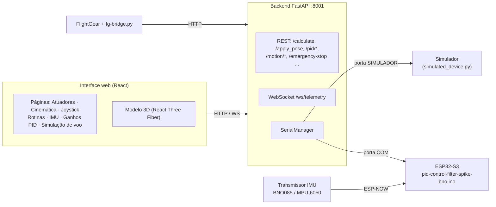

[REACT__BADGE]: https://img.shields.io/badge/react-%2320232a.svg?style=for-the-badge&logo=react&logoColor=%2361DAFB
[TS__BADGE]: https://img.shields.io/badge/typescript-%23007ACC.svg?style=for-the-badge&logo=typescript&logoColor=white
[THREE__BADGE]: https://img.shields.io/badge/three.js-000000?style=for-the-badge&logo=threedotjs&logoColor=white
[FastAPI__BADGE]: https://img.shields.io/badge/FastAPI-005571?style=for-the-badge&logo=fastapi
[TailwindCSS__BADGE]: https://img.shields.io/badge/tailwindcss-%2338B2AC.svg?style=for-the-badge&logo=tailwind-css&logoColor=white

<div align="center">


<hr/>

<h1 align="center" style="font-weight: bold;">PLATAFORMA DE STEWART</h1>

![REACT][REACT__BADGE]
![TYPESCRIPT][TS__BADGE]
![THREE.JS][THREE__BADGE]
![TAILWIND][TailwindCSS__BADGE]
![FASTAPI][FastAPI__BADGE]

</div>

## Visão Geral

Este repositório reúne o projeto da Plataforma de Stewart do IFSP (TCC 2025):

- **interface web** em React + Three.js (`interface/web`), com modelo 3D da bancada, tema claro/escuro e acessibilidade;
- **backend** FastAPI (`interface/backend`), que calcula a cinemática e conversa com o ESP32 pela serial;
- **firmwares** do ESP32-S3 (`esp32s3_codes`).

O backend também tem um **dispositivo virtual (simulador)**: dá para usar toda a interface e validar movimentos sem hardware.

## Arquitetura


```mermaid
flowchart LR
    subgraph Web ["Interface web (React)"]
        P["Páginas: Atuadores · Cinemática · Joystick<br>Rotinas · IMU · Ganhos PID · Simulação de voo"]
        V["Modelo 3D (React Three Fiber)"]
    end

    subgraph Backend ["Backend FastAPI :8001"]
        R["REST: /calculate, /apply_pose, /pid/*,<br>/motion/*, /emergency-stop ..."]
        W["WebSocket /ws/telemetry"]
        S["SerialManager"]
    end

    SIM["Simulador<br>(simulated_device.py)"]
    FW["ESP32-S3<br>pid-control-filter-spike-bno.ino"]
    IMU["Transmissor IMU<br>BNO085 / MPU-6050"]
    FG["FlightGear + fg-bridge.py"]

    Web -->|HTTP / WS| Backend
    S -->|porta COM| FW
    S -->|porta SIMULADOR| SIM
    IMU -->|ESP-NOW| FW
    FG -->|HTTP| Backend
```

## Executando

### Pré-requisitos

- **Python 3.12** oficial para Windows ([python.org](https://www.python.org/downloads/windows/)). A 3.12.10 é a última 3.12 com instalador para Windows. Na instalação, marque _Add python.exe to PATH_.
  - Cuidado com Pythons embutidos em outros programas (por exemplo o do Inkscape), que criam o ambiente virtual num formato incompatível. O `start.bat` detecta e recusa esses casos.
- **Node.js não é necessário** para usar a bancada: o build da interface (`interface/web/dist`) vem pronto no repositório. Só é preciso Node 24 para desenvolver o frontend.

### Iniciar

Na raiz do projeto:

```bat
start.bat
```

O script:

1. procura o Python 3.12 (primeiro `py -3.12`, depois `python`);
2. cria o ambiente virtual em `interface/backend/.venv` e instala as dependências;
3. sobe o FastAPI em `http://localhost:8001`;
4. abre a interface em **http://localhost:8001/**.

| Endereço                      | Conteúdo                                               |
| ----------------------------- | ------------------------------------------------------ |
| http://localhost:8001/        | Interface nova (React)                                 |
| http://localhost:8001/antigo/ | Interface antiga (HTML/JS), mantida durante a migração |
| http://localhost:8001/docs    | Documentação interativa da API                         |

> Se aparecer "O ambiente virtual existente é inválido", apague a pasta `interface/backend/.venv` e rode o `start.bat` de novo.

## Modo simulação (sem hardware)

No topo da interface, escolha **Simulador** e clique em **Conectar**. O selo muda para **SIMULAÇÃO** (azul). Nada físico se move, e todas as páginas funcionam.

- O backend passa a usar `interface/backend/simulated_device.py` no lugar da porta serial. Ele aceita os mesmos comandos do firmware (`spmm6x=`, `sel=`, `kpmm=`, `A`/`R`/`OK`...), roda o mesmo PID e responde com a mesma telemetria CSV.
- A dinâmica de cada atuador (velocidade máxima e zona morta) foi ajustada aos ensaios de degrau reais (`MATLAB/workspace1-6.mat`) por `interface/backend/tools/fit_sim_params.py`, com fit de ~90%. Os parâmetros ficam em `interface/backend/sim_params.json`.
- No modelo 3D, a plataforma sólida é a medida (telemetria) e o **fantasma verde** é a pose comandada. A diferença entre as duas mostra o atraso real dos atuadores.
- A página **Rotinas** estima a velocidade de pico que cada movimento exige e avisa quando ela passa do que os atuadores sustentam (~12 mm/s).
- Nas páginas Joystick e IMU há controles virtuais (sliders) para quando não há gamepad ou sensor.
- A **Bancada 3D** (`/bancada-3d`) traz o modelo mais detalhado, com tela cheia. Clique num pistão e arraste a seta para mudar só o comprimento dele: os outros cinco ficam fixos e o tampo se acomoda pela cinemática direta. Clique no ponto verde do tampo para mover a plataforma inteira em Z, roll, pitch ou yaw. Tudo também funciona pelo teclado.

Para usar o hardware, selecione a porta COM do ESP32-S3 e confirme. O selo fica vermelho, **HARDWARE REAL**.

### Segurança

- **Parar** (ou a tecla **Esc**) chama `POST /emergency-stop`: interrompe rotinas e a simulação de voo, tira o firmware do modo manual (`OK`) e congela os atuadores na posição atual. Joystick, IMU e "aplicar automaticamente" desligam sozinhos.
- O backend escuta só em `127.0.0.1`, e o CORS é restrito ao próprio servidor e ao servidor de desenvolvimento.

## Desenvolvimento

### Backend

```bat
cd interface\backend
.venv\Scripts\activate
pip install -r requirements.txt pytest
uvicorn app:app --reload --port 8001
pytest
```

Os testes automatizados ficam em `interface/backend/tests/` e cobrem a cinemática, o simulador e a API com o simulador conectado. Os `test_*.py` soltos na pasta do backend são scripts manuais antigos (precisam de servidor ou hardware) e o `pytest.ini` os ignora.

### Frontend (`interface/web`)

```bat
cd interface\web
npm install
npm run dev
```

O servidor de desenvolvimento fica em http://localhost:5173 e repassa a API para o backend em `:8001`.

| Comando                              | O que faz                                                                           |
| ------------------------------------ | ----------------------------------------------------------------------------------- |
| `npm run build`                      | Gera `dist/`, que o FastAPI serve. **Rode antes de commitar** mudanças no frontend. |
| `npm run lint` / `npm run typecheck` | ESLint (inclui regras de acessibilidade jsx-a11y) e TypeScript                      |
| `npm test`                           | Testes unitários (Vitest)                                                           |
| `npm run test:e2e`                   | Playwright + axe contra o build, com o simulador (usa o Edge instalado no Windows)  |

Detalhes de arquitetura, tema IFSP, acessibilidade e o fluxo para melhorar o modelo 3D no Blender estão em [interface/web/README.md](interface/web/README.md).

### Integração contínua

`.github/workflows/ci.yml` roda pytest, lint, tipos, testes, build e os testes de ponta a ponta com acessibilidade em cada PR. Em tags `v*`, anexa o build (`stewart-web-dist.zip`) à release.

### Firmware ESP32-S3

- **Arduino IDE 2.x**, com o core _esp32 by Espressif Systems_ **2.0.x** (testado na 2.0.15). O core 3.x muda `ledcSetup`/`ledcAttachPin` e o callback do ESP-NOW, e o código não compila nele.
- **Bibliotecas:** SparkFun BNO08x Cortex Based IMU 1.0.6 e MPU6050_light.
- **Driver USB-serial:** CP210x ([tutorial Robocore](https://www.robocore.net/tutoriais/instalando-driver-do-nodemcu)).

| Sketch                                                                 | Função                                                                                     |
| ---------------------------------------------------------------------- | ------------------------------------------------------------------------------------------ |
| `esp32s3_codes/stewart-platform-control/pid-control-filter-spike-bno/` | Firmware principal: PID dos 6 atuadores, telemetria, receptor ESP-NOW                      |
| `esp32s3_codes/stewart-platform-control/BNO085/`                       | Transmissor de orientação com BNO085                                                       |
| `esp32s3_codes/stewart-platform-control/mpu-6050/`                     | Transmissor de orientação com MPU-6050                                                     |
| `esp32s3_codes/others/`                                                | Sketches de teste antigos (algumas pinagens diferem da principal: não gravar sem conferir) |

Comandos seriais e telemetria: [PID-CONTROL-FILTER-SPIKE-BNO.md](PID-CONTROL-FILTER-SPIKE-BNO.md).

## Estrutura do repositório

| Pasta                       | Conteúdo                                                       |
| --------------------------- | -------------------------------------------------------------- |
| `interface/web`             | Interface React (código em `src/`, build em `dist/`)           |
| `interface/backend`         | FastAPI, simulador, testes (`tests/`) e ferramentas (`tools/`) |
| `interface/frontend`        | Interface antiga (servida em `/antigo/` até o fim da migração) |
| `interface/simulation`      | Ponte FlightGear (`fg-bridge.py`) e assets do FlightGear       |
| `interface-coleta-de-dados` | Aplicativos Python usados nas aquisições do TCC                |
| `esp32s3_codes`             | Firmwares do ESP32-S3                                          |
| `MATLAB`                    | Identificação de sistema e projeto dos controladores           |
| `aquisições`                | Dados brutos dos ensaios (CSV) por pistão                      |
| `3D-drawings-archives`      | Peças para impressão 3D (STL/3MF)                              |
| `docs`                      | Monografia, apresentação e cópias em PDF da documentação       |

## Documentação por módulo

Os documentos abaixo descrevem a **interface antiga** (em `/antigo/`) e os endpoints, que continuam os mesmos:

- [JOYSTICK-CONTROL-README.md](JOYSTICK-CONTROL-README.md) e [CONTROLLER-README.md](CONTROLLER-README.md): joystick e `/joystick/pose`
- [KINEMATICS-README.md](KINEMATICS-README.md): cinemática, `/calculate` e `/apply_pose`
- [ACCELEROMETER-README.md](ACCELEROMETER-README.md): controle por IMU e `/mpu/control`
- [ROUTINES-README.md](ROUTINES-README.md): rotinas e `/motion/*`
- [ACTUATORS-README.md](ACTUATORS-README.md): telemetria, setpoints e comandos manuais
- [SETTINGS-README.md](SETTINGS-README.md): `/pid/gains` e `/pid/settings`
- [FLIGHTGEAR-README.md](FLIGHTGEAR-README.md): integração com o FlightGear
- Firmware: [PID-CONTROL-FILTER-SPIKE-BNO.md](PID-CONTROL-FILTER-SPIKE-BNO.md), [BNO085-README.md](BNO085-README.md), [MPU6050-README.md](MPU6050-README.md)

## Versionamento

A branch padrão é `main`. Use uma branch por mudança (`feat/...`, `fix/...`, `docs/...`) e abra um Pull Request: o CI precisa passar antes do merge.

### Autor

**Guilherme Miyata** - Instituto Federal de São Paulo (IFSP)
Trabalho de Conclusão de Curso - 2025

---

<a href='https://github.com/g-Miyata'>Github</a><br>
<a href='https://www.linkedin.com/in/g-miyata'>Linkedin</a><br>
<a href='https://www.g-miyata.com'>Portfólio</a>

**Última atualização:** Setembro 2026
